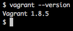
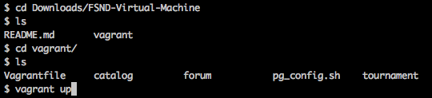
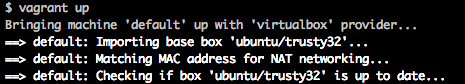
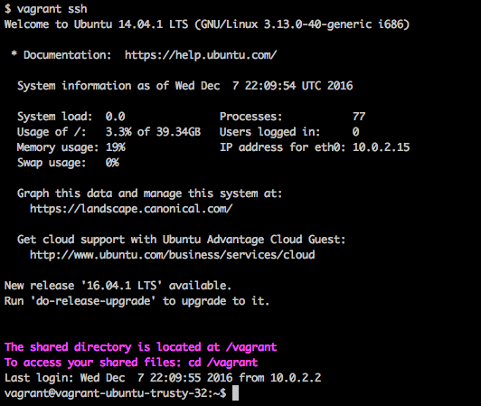
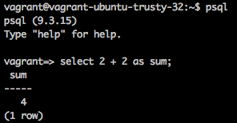

# LOGS ANALYSIS TOOL : newspaper site internal reporting tool
by Shubham Prakash

## About
A **Newspaper Site's** **_internal reporting tool_** that will use information from the live _database_ with over a **million rows** to discover what kind of _articles_ the site's _readers like_ to _draw business conclusions_ from data using both from the command line and the python code.


## REQUIREMENTS

1. [**VirtualBox**](https://www.virtualbox.org/wiki/Download_Old_Builds_5_1), software that will run your virtual machine

2. [**VAGRANT**](https://www.vagrantup.com/), the Linux-based virtual machine (VM)

3. `newsdata.sql` file. 

4. Clone the repository `Logs Analysis` in the `/vagrant`  directory shared with your virtual machine

5. Recreate `views` in the `news` _database_ as shown below.

## HOW TO SETUP DATABASE

1. Install vagrant, to install you can check the below link. This will give you the PostgreSQL database and support software needed for this project

    [Instructions to install the vagrant virtual machine](https://www.udacity.com/wiki/ud088/vagrant)
    
    

2. Download the Virtual Machine configuration file and unzip it.This will give you a directory called FSND-Virtual-Machine. Change to this directory in your terminal with cd. Inside, you will find another directory called vagrant. Change directory to the vagrant directory.
    
    [FSND-Virtual-Machine.zip](https://d17h27t6h515a5.cloudfront.net/topher/2017/August/59822701_fsnd-virtual-machine/fsnd-virtual-machine.zip)
    
    

3. After installing vagrant, Bring the virtual machine back online using
	```
	 vagrant up
	```
	

4. log into it using `vagrant up` to Successfully logged into the virtual machine
	```
	 vagrant ssh
	```
    
 
5. download `newsdata.sql` file.
 
    [ download newsdata.sql file here](https://d17h27t6h515a5.cloudfront.net/topher/2016/August/57b5f748_newsdata/newsdata.zip)

6. unzip this file and Put this file into the `vagrant directory` shared with your virtual machine


7. now cd into the vagrant directory
	```commandline
	 cd /vagrant
	```

8. load the data from `newsdata.sql` to `news` _database_ and cd into the vagrant directory using the command
	```commandline
	 psql -d news -f newsdata.sql
	```

9. connect to postgreSQL using command(for rest of the time)
	```commandline
	 psql
	```
	
	
10. select the news database using
	```postgresql
	 \c news
	```
    now you will be connected to the news database which have three tables i.e `authors`, `articles`,`log`.

## INITIALIZATION:  create views
To successfully run the `report.py` file in the repository we need to create views in the `news` **database**.

#### To recreate the views:
- Select 'news' database in psql using
    ```commandline
    psql news
    ```
- Copy and run the below query commands:
    
    1. To create popular_artist view for second question.
        ```sql
        create view popular_articles as
    	    select title, count(*) as views
    	    from log join articles
    	    on log.path = concat('/article/',articles.slug) 
    	    group by title, status 
    	    order by status, views desc
    	    limit 3;
        ```
    2. To create popular_articles view for first question.
        ```sql
        create view popular_authors as
    	    select authors.name, count(*) as views
    	    from articles,authors,log
    	    where articles.author = authors.id and log.path = concat('/article/',articles.slug)
    	    group by authors.name, status
    	    order by status, views desc;
        ```
    3. To create most_errors view for third question.
        ```sql
        create view all_error as
            select cast(time as date) as day, count(*) as error 
            from(select * from log where status like '404%') as tab 
            group by day 
            order by day;
        ```
        ```sql
        create view all_request as
            select cast(time as date) as day, count(*) as request 
            from log 
            group by day 
            order by day;
        ```
        ```sql
        create view avg_error as
            select all_error.day,request,error,round(100.0*error/request,2) as perc_error
            from all_request,all_error
            where all_request.day = all_error.day;
        ```
        ```sql
        create view most_errors as
            select to_char(day,'FMMonth DD, YYYY') as day, perc_error 
            from avg_error
            where perc_error > 1.00
            order by perc_error;
        ```
## HOW TO RUN
1. Download or Clone the Repository in `/vagrant`
2. Initialize the Vagrant using `vagrant up`.
3. Connect to virtual machine `vagrant ssh`.
4. navigate to Logs analysis directory
    ```commandline
        cd /vagrant/LogsAnalysis
    ```
5. run the python application.
    ```commandline
       python3 reportmodular.py
    ```
