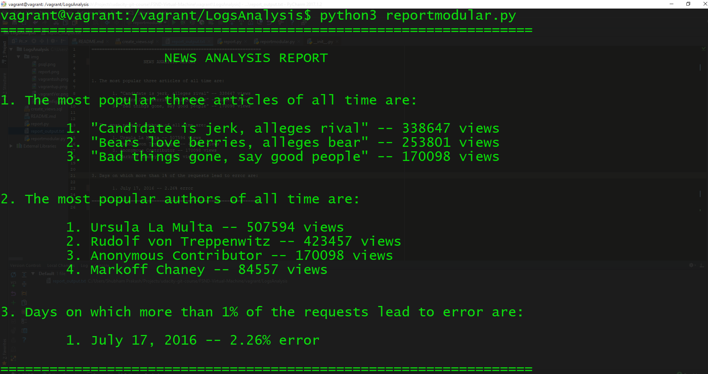

# LOGS ANALYSIS TOOL : newspaper site internal reporting tool
by Shubham Prakash

## About
A **Newspaper Site's** **_internal reporting tool_** that will use information from the live _database_ with over a **million rows** to discover what kind of _articles_ the site's _readers like_ to _draw business conclusions_ from data using both from the command line and the python code.



## REQUIREMENTS
1. This project makes use of **VAGRANT**, a Linux-based virtual machine (VM)

2. `newsdata.sql` file. 

3. Clone the repository `Logs Analysis` in the `/vagrant`  directory shared with your virtual machine

4. Recreate `views` in the `news` _database_ as shown below.

## HOW TO SETUP DATABASE

To install vagrant you can check below link. This will give you the PostgreSQL database and support software needed for this project

[Instructions to install the vagrant virtual machine](https://d17h27t6h515a5.cloudfront.net/topher/2016/August/57b5f748_newsdata/newsdata.zip)

After installing vagrant, Bring the virtual machine back online using
```
    vagrant up
```
log into it using `vagrant up` to Successfully logged into the virtual machine
```
    vagrant ssh
```

 download `newsdata.sql` file.
 
 

[ download newsdata.sql file here](https://classroom.udacity.com/nanodegrees/nd004/parts/8d3e23e1-9ab6-47eb-b4f3-d5dc7ef27bf0/modules/bc51d967-cb21-46f4-90ea-caf73439dc59/lessons/5475ecd6-cfdb-4418-85a2-f2583074c08d/concepts/14c72fe3-e3fe-4959-9c4b-467cf5b7c3a0)

unzip this file and Put this file into the vagrant directory shared with your virtual machine


now cd into the vagrant directory
```
 cd /vagrant
```

use the command(use it only once)
```
 psql -d news -f newsdata.sql
```
connect to postgreSQL using command(for rest of the time)
```angular2html
 psql
```
select the news database using
```angular2html
 \c news
```
now you will be connected to the news database which have three tables i.e `authors`, `articles`,`log`.

## INITIALIZATION:  create views
To successfully run the `report.py` file in the repository we need to create views in the `news` **database**.

#### to recreate the views:
- select 'news' database in psql using
    ```angular2html
    psql news
    ```
- copy and run the below query commands:
    
    1. to create popular_artist view for second question.
    ```angular2html
    create view popular_articles as
	    select title, count(*) as views
	    from log join articles
	    on log.path = concat('/article/',articles.slug) 
	    group by title, status 
	    order by status, views desc
	    limit 3;

    ```
    2. to create popular_articles view for first question.
    ```angular2html
    create view popular_authors as
	    select authors.name, count(*) as views
	    from articles,authors,log
	    where articles.author = authors.id and log.path = concat('/article/',articles.slug)
	    group by authors.name, status
	    order by status, views desc;

    ```
    3. to create most_errors view for third question.
    ```angular2html
    create view all_error as
        select cast(time as date) as day, count(*) as error 
        from(select * from log where status like '404%') as tab 
        group by day 
        order by day;
    ```
    ```
    create view all_request as
        select cast(time as date) as day, count(*) as request 
        from log 
        group by day 
        order by day;

    ```
    ```
    create view avg_error as
        select all_error.day,request,error,round(100.0*error/request,2) as perc_error
        from all_request,all_error
        where all_request.day = all_error.day;
    ```
    ```
    create view most_errors as
        select to_char(day,'Month DD, YYYY') as day, perc_error 
        from avg_error
        where perc_error > 1.00
        order by perc_error;

    ```
## HOW TO RUN
1. Download or Clone the Repository in `/vagrant`
2. Initialize the Vagrant using `vagrant up`.
3. Connect to virtual machine `vagrant ssh`.
4. navigate to Logs analysis directory
```angular2html
    cd /vagrant/LogsAnalysis
```
5. run the python application.
```angular2html
    python3 report.py
```
